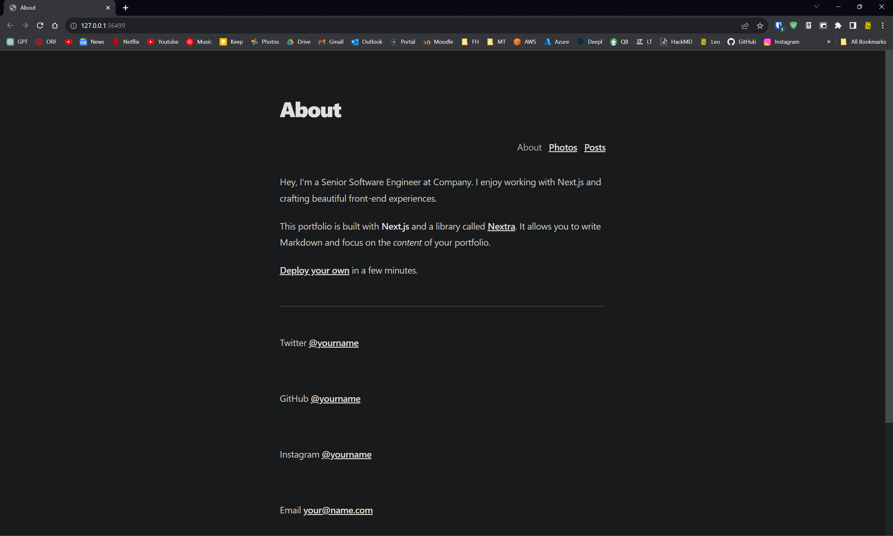
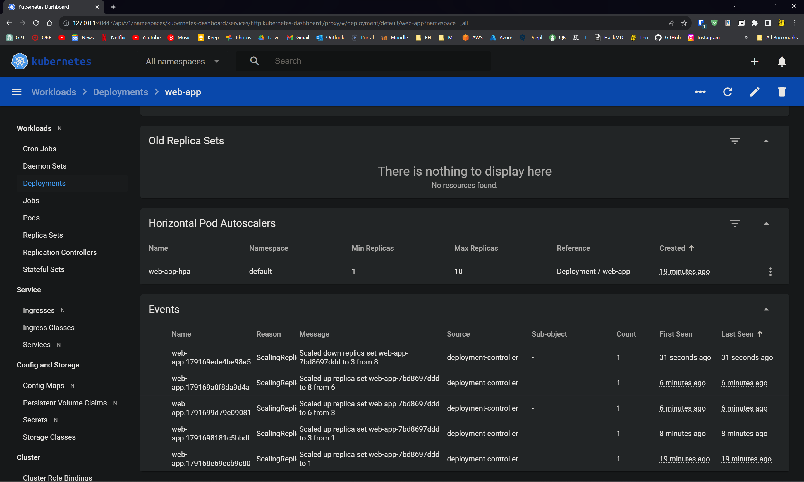

# Task 5 description

In order to validate the effectiveness of the hpa.yaml configuration, a BusyBox pod was deployed to generate a consistent load against the web server (hosted at `127.0.0.1:36499` in this scenario).

The pod was created using the following command:
`kubectl run busybox --image=busybox --restart=Never -- /bin/sh -c "while true; do wget -q -O- http://127.0.0.1:36499/; done"
pod/busybox created`

Through monitoring on the Kubernetes dashboard, it was observed that the Horizontal Pod Autoscaler (HPA) was functioning as intended. Initially, the deployment was configured with a single replica, but as the load increased due to the BusyBox pod's requests, the HPA dynamically scaled the number of replicas up to 8 to accommodate the heightened demand.'

This behavior aligns with the defined HPA configuration, demonstrating its capability to automatically adjust the replica count based on the load, thus ensuring the web application remains responsive even under increased traffic.
